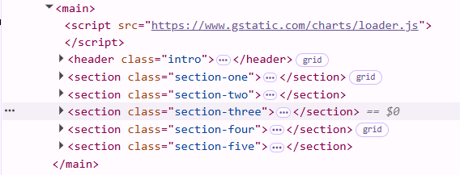
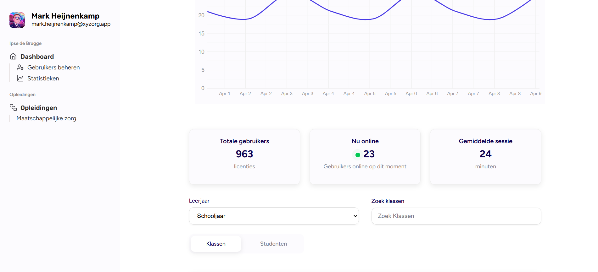
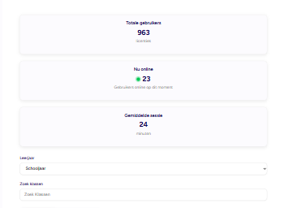
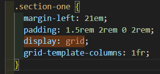
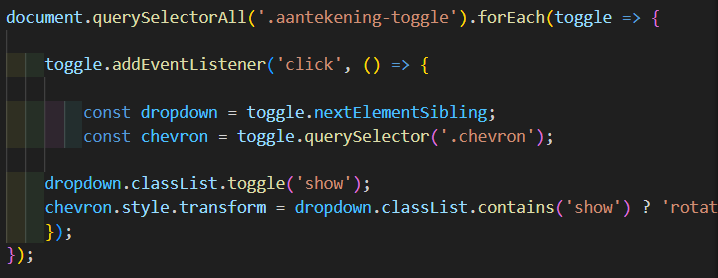
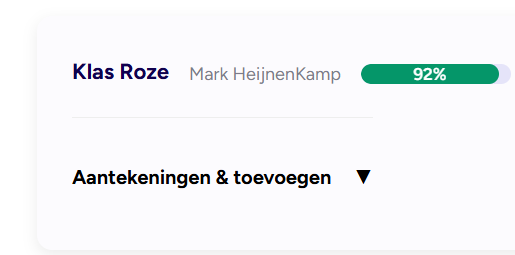
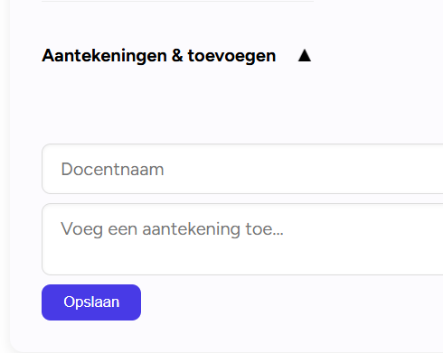

Ontwerp en maak een data driven online concept voor een opdrachtgever

De instructies voor deze opdracht staan in: [docs/INSTRUCTIONS.md](https://github.com/fdnd-task/proof-of-concept/blob/main/docs/INSTRUCTIONS.md)

# Titel
<!-- Geef je project een titel en schrijf in één zin wat het is -->

## Inhoudsopgave

  * [Beschrijving](#beschrijving)
  * [Gebruik](#gebruik)
  * [Kenmerken](#kenmerken)
  * [Installatie](#installatie)
  * [Bronnen](#bronnen)
  * [Licentie](#licentie)

## Beschrijving
<!-- Bij Beschrijving staat kort beschreven wat voor project het is en wat je hebt gemaakt -->
Dit project is een opdracht die we hebben gekregen van Future Ready zij zijn een software agency die zich focussen op digitale oplossingen met een positieve impact. Wij kregen de opdracht om te werken aan ONYX waarbij we een platform moesten ontwikkelen waar leraren werk en voortgan van studenten kunnen zien.

<!-- Voeg een mooie poster visual toe 📸 -->

<!-- Voeg een link toe naar Github Pages 🌐-->
https://proof-of-concept-ehok.onrender.com/

## Gebruik
<!-- Bij Gebruik staat de user story, hoe het werkt en wat je er mee kan. -->
Je kunt met deze pagina als eindgebruiker toegang krijgen over de prestaties van klassen en studenten hierdoor krijgen docenten een beter overzicht hoe goed het gaat met een klas 

## Kenmerken
<!-- Bij Kenmerken staat welke technieken zijn gebruikt en hoe. Wat is de HTML structuur? Wat zijn de belangrijkste dingen in CSS? Wat is er met JS gedaan en hoe? Misschien heb je iets met NodeJS gedaan, of heb je een framwork of library gebruikt? -->
### HTML structuur
Ik heb semantische html gebruikt om de structuur duidelijk en toegankelijk te houden door bijv gebruik te maken van een main en sections dit zorgt voor
 duidelijke betekenis van de inhoud ik heb ook logische headings toegepast alleen is de hierarchie op sommige plekken nog niet goed en moet verbeterd worden 

### CSS styling
De CSS is opgesplitst in twee bestanden
- Sidebar.css -> deze is voor de sidebar

position fixed heb ik hier toegepast omdat de sidebar dan aan de zijkant blijft staan

- Style.css -> deze is voor de rest van de pagina 

ik heb gebruik gemaakt van tablet-first ik begin met het werken op het formaat van de kleinste tablet en vanuit daar ben ik verder gaan werken naar ruimere schermen zoals een desktop voorbeelden: 

desktop: 
ipad: 

 en grid layout 

### JS
1. Ik heb een toggle functionaliteit gemaakt waardoor eindgebruikers aantekeningen per klas kunnen toevoegen

voorbeeld:

Feedforward: 

de chevron staat omlaag 

feedback:

als je er dan vervolgens op klikt wijst de chevron naar boven en krijg je het aantekeningen veld te zien 

Gebruikte libraries & tools
google library charts: gebruikt voor het visueel maken van gebruikersdata
Lighthouse/webpagetester/w3validtor: gebruikt voor het testen van perfomance accesibility en html structuur 

## Installatie
<!-- Bij Instalatie staat hoe een andere developer aan jouw repo kan werken -->

## Bronnen

## Licentie

This project is licensed under the terms of the [MIT license](./LICENSE).
